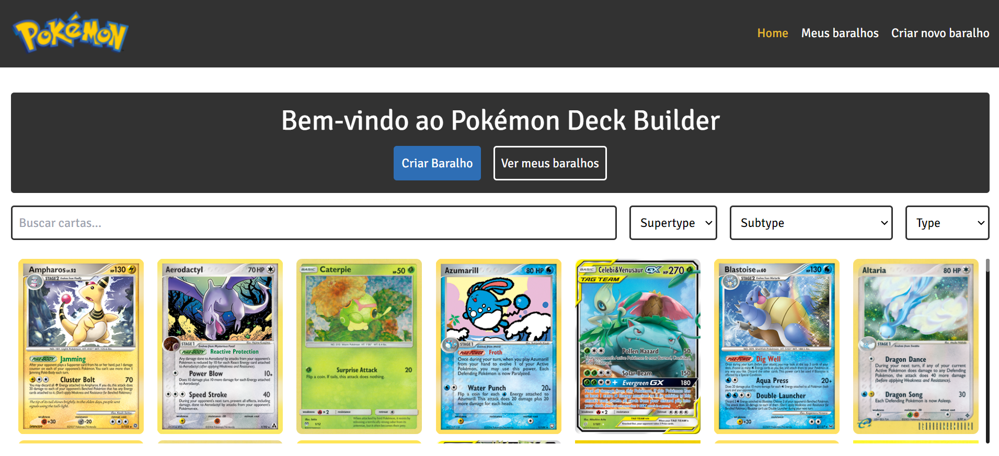
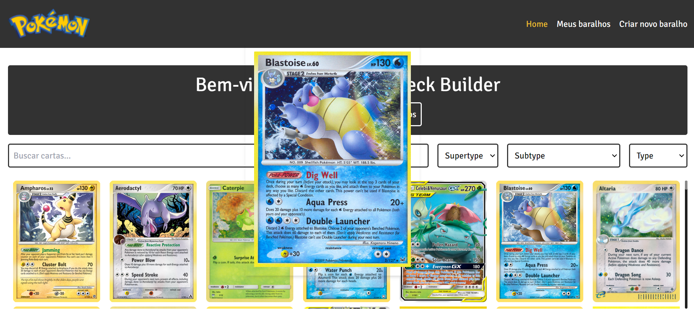
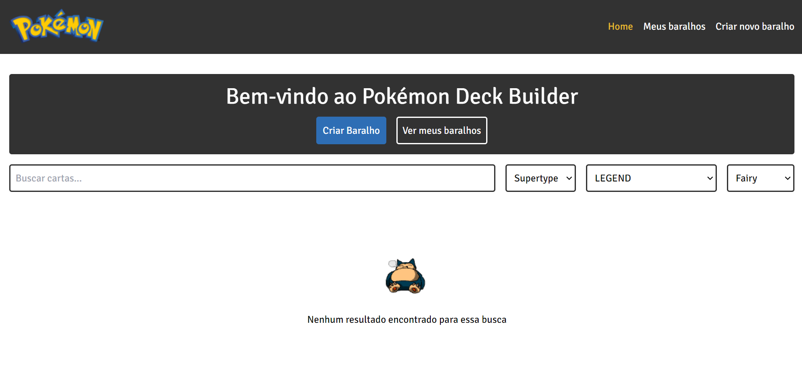
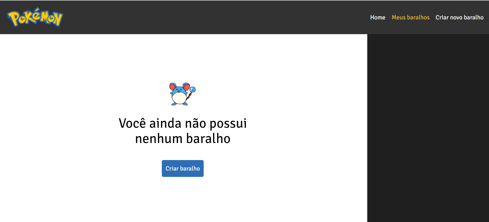
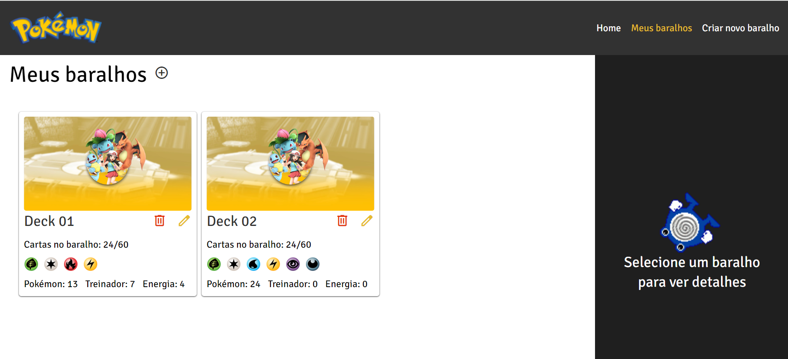
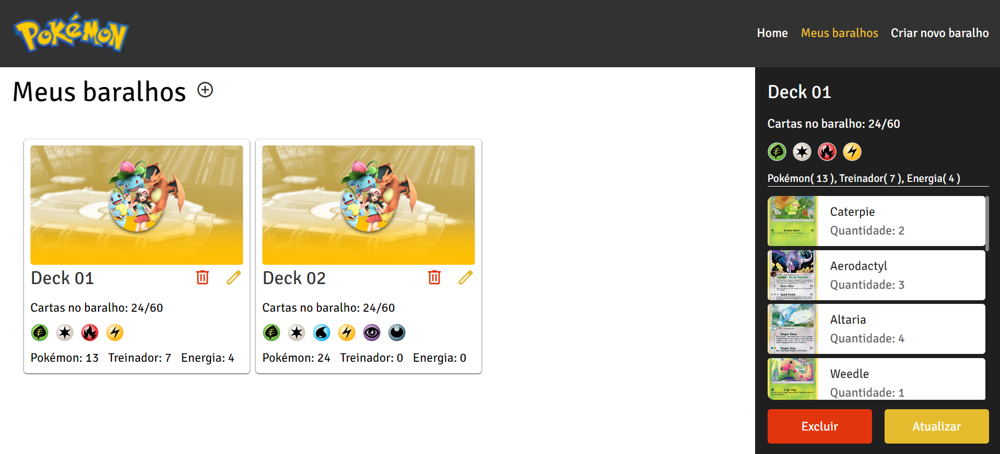
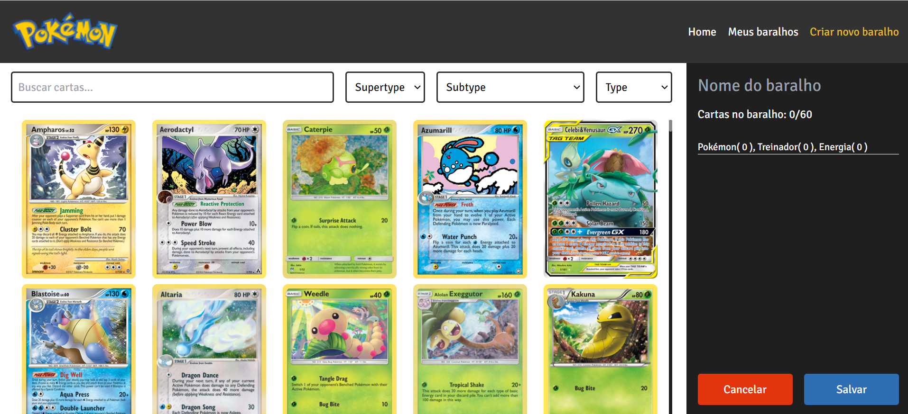
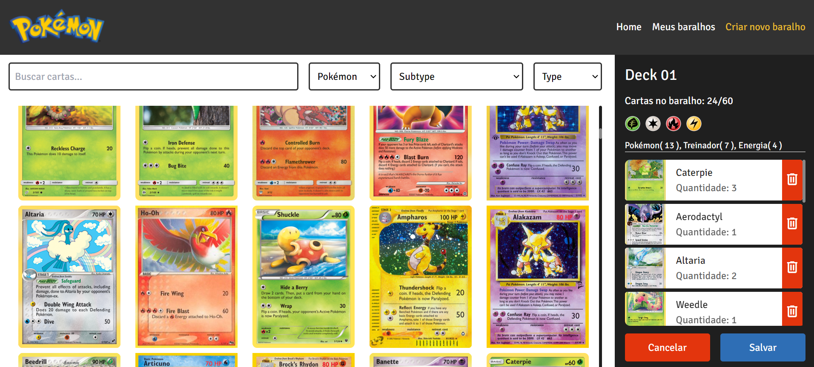
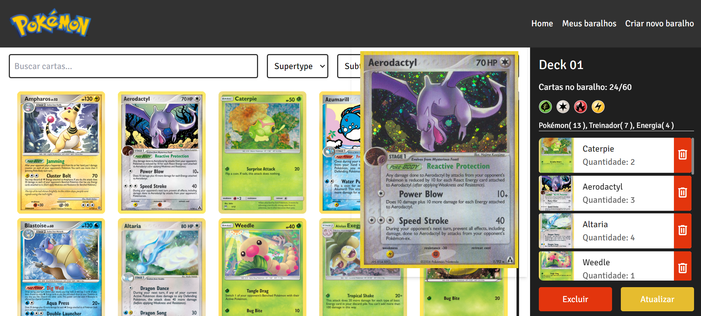

# Pokemon Deck Builder

<h1 align="center">
    
</h1>

<h4 align="center"> 
	🚧 Pokemon Deck Builder 🚧
</h4>

<p align="center">
	
	<!--  -->
</p>

<p align="center">
 <a href="#-sobre-o-projeto">Sobre</a> •
 <a href="#-funcionalidades">Funcionalidades</a> •
 <a href="#-requisitos-tecnicos">Requisitos técnicos</a> •
 <a href="#-layout">Layout</a> • 
 <a href="#-como-executar-o-projeto">Como executar</a> • 
 <a href="#-tecnologias">Tecnologias</a> • 
 <a href="#-autor">Autor</a> • 
 <a href="#user-content--licença">Licença</a>
</p>


## 💻 Sobre o projeto

A aplicação é desenvolvida utilizando Angular 16+, Tailwind CSS e a biblioteca de UI Infragistics, com o objetivo de permitir que os jogadores montem baralhos de cartas utilizando a API de Pokémon TCG. A aplicação oferece funcionalidades para criar, visualizar, editar e remover baralhos, além de visualizar detalhes específicos de cada baralho. Os dados dos baralhos são armazenados apenas em memória.

<!-- Acesse via Browser | Deploy: [Pokemon Deck Builder]() -->

---

## ⚙️ Funcionalidades

- Lista de Baralhos:
    - Visualizar todos os baralhos do usuário.
    - Criar um novo baralho.
    - Remover um baralho existente.
    - Editar um baralho.
    - Visualizar detalhes de um baralho ao clicar nele.

- Criação de Baralho:
    - Definir um nome para o baralho.
    - Inserir cartas no baralho.
    - Garantir que o baralho tenha entre 24 e 60 cartas.
    - Limitar a 4 o número de cartas com o mesmo nome no baralho.
    - Atualizar a lista de baralhos após salvar um novo baralho.

- Detalhes do Baralho:
    - Exibir a quantidade de Pokémon e cartas de treinador no baralho.
    - Mostrar a diversidade de cores no baralho com base nos tipos únicos de cartas.

---

### ⚙️ Requisitos Técnicos

  - Uso de Angular 16+ para o desenvolvimento da aplicação.
  - Utilização de Tailwind CSS para estilização.
  - Emprego da biblioteca UI Infragistics para componentes de interface.
  - Integração com a API de Pokémon TCG para buscar cartas.
  - Armazenamento de dados dos baralhos em memória.


## 🎨 Layout

### Web

<p align="center" style="display: flex; align-items: flex-start; justify-content: center;">
  
  
  
  
  
  
    
  
  
</p>

---

## 🛣️ Como executar o projeto

### Pré-requisitos

Antes de começar, você vai precisar ter instalado em sua máquina as seguintes ferramentas:
[Git](https://git-scm.com), [Node.js](https://nodejs.org/en/). 
Além disto é bom ter um editor para trabalhar com o código como [VSCode](https://code.visualstudio.com/)


#### 🎲 Rodando o projeto localmente

```bash

# Clone este repositório
$ git clone git@github.com:marianasocastro/pokemon-deck-builder.git

# Acesse a pasta do projeto no terminal/cmd
$ cd nome-do-repositorio

# Instale as dependências
$ npm install

# Execute a aplicação local
$ ng serve

# O projeto rodará na porta:4200 - acesse http://localhost:4200 

```

---

## 🛠 Tecnologias

As seguintes ferramentas foram usadas na construção do projeto:

#### **Website**  ([Angular](https://angular.dev/)  +  [TypeScript](https://www.typescriptlang.org/) +  [TailWind](https://tailwindcss.com/) +  [UI Infragistics](https://www.infragistics.com/)) 

#### []()**Utilitários**

-   Protótipo:  **[Figma](https://www.figma.com/)**  →  **[Protótipo - ](https://www.figma.com/design/QvTKqSZkg0ejohGqksi4yC/Pokemon-Trading-Card-Builder-(Community)?node-id=7-87&t=wvugPrlFFtNDfuSp-1)**
-   API:  **[Pokemon TCG API](https://docs.pokemontcg.io/)**
-   Editor:  **[Visual Studio Code](https://code.visualstudio.com/)** 
<!-- -   Markdown:  **[StackEdit](https://stackedit.io/)**,  **[Markdown Emoji](https://gist.github.com/rxaviers/7360908)**
-   Commit Conventional:  **[Commitlint](https://github.com/conventional-changelog/commitlint)** -->
-   Teste de API:  **[Thunder Client](https://www.thunderclient.com/)**
<!-- -   Ícones:  **[Font Awesome](https://fontawesome.com/)** -->
-   Fontes:  **[Signika Negative]('https://fonts.googleapis.com/css2?family=Signika+Negative:wght@300..700&display=swap')**

---

## 💪 Como contribuir para o projeto

1. Faça um **fork** do projeto.
2. Crie uma nova branch com as suas alterações: `git checkout -b my-feature`
3. Salve as alterações e crie uma mensagem de commit contando o que você fez: `git commit -m "feature: My new feature"`
4. Envie as suas alterações: `git push origin my-feature`
> Caso tenha alguma dúvida confira este [guia de como contribuir no GitHub](./CONTRIBUTING.md)

---

## 🧙‍♂️ Autor

Feito com ❤️ por Mariana Castro👋🏽 [Entre em contato!](https://www.linkedin.com/in/marianasocastro/)

---

## 📝 Licença

Este projeto esta sobe a licença [MIT](./LICENSE).


